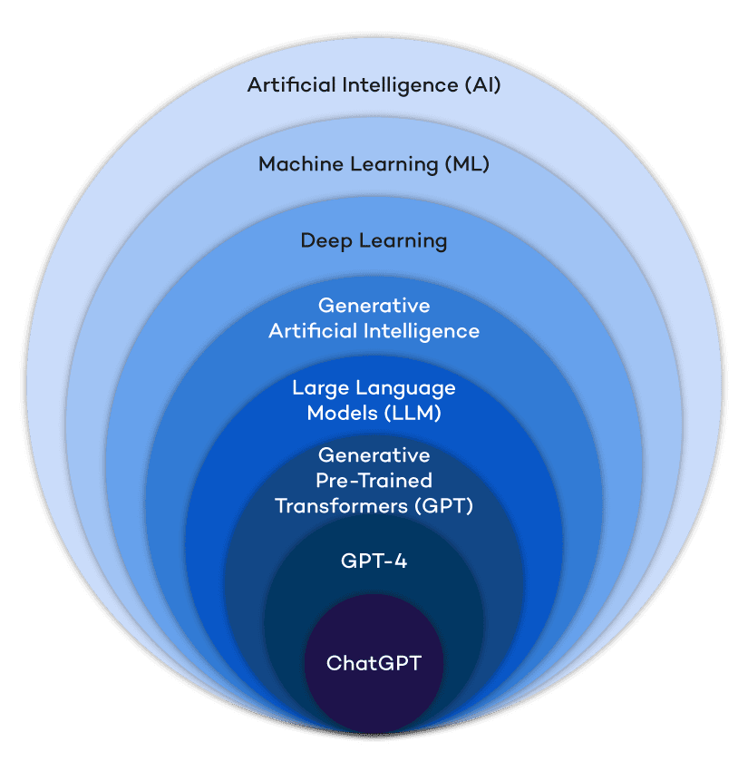

<!-- _class: lead -->
# Kecerdasan Buatan  
## Minggu 1 — Orientasi & Filosofi AI

<div class="muted">Program Studi Teknologi Rekayasa Perangkat Lunak (TRPL)</div>

> Tujuan hari ini: memahami **apa itu AI**, posisi AI/ML/DL/GenAI, sejarah singkat, ruang masalah, contoh di TRPL, serta **etika & privasi**.  
> Aktivitas: diskusi studi kasus lokal, akses Google Colab, dan `git init` proyek.

---

## Agenda

1. Icebreaker & ekspektasi kelas  
2. **Apa itu AI?** Definisi praktis & filosofi  
3. **Hierarki**: AI → ML → DL → GenAI  
4. Sejarah singkat & mengapa sekarang  
5. **Ruang masalah** & contoh kasus di TRPL  
6. **Etika & privasi**: aman, adil, patuh  
7. Setup alat: **Colab** & **Git**  
8. **Tugas M1**: Ide proyek + problem statement + scope + metrik + README & issue board

---

## Kontrak Belajar Singkat

- Fokus pada **pemahaman konsep** dan **membuat prototipe** yang realistis.  
- Praktik mingguan → **satu proyek akhir (UAS)**.  
- Boleh kolaborasi, **hargai orisinalitas** dan atribusi.  
- Komunikasi: jelas, singkat, dan berbasis bukti.  
- Nilai ≠ magic model; **nilai = pemilihan masalah + metodologi + eksperimen + etika**.

---

## Apa itu AI? (definisi kerja)

> **AI**: Sistem yang meniru aspek **kecerdasan** untuk **mencapai tujuan** di lingkungan tertentu.

- **Berbasis aturan** (symbolic): if–then, logika, pengetahuan pakar.  
- **Berbasis data** (statistical): belajar pola dari data (ML/DL).  
- **Berorientasi tujuan**: optimisasi, perencanaan, agen.  
- **Pragmatis**: bukan meniru manusia persis, tapi **memecahkan masalah** secara andal.

**Inti untuk TRPL:** AI adalah **fitur** dalam produk perangkat lunak, bukan tujuan itu sendiri.

---

## Filosofi Singkat

- **Berpikir vs Bertindak**, **Rasional vs Manusiawi**  
  - *Berpikir rasional*: logika, pembuktian.  
  - *Bertindak rasional*: agen yang memaksimalkan utilitas.  
- **Symbolic vs Connectionist**  
  - Representasi eksplisit vs pembelajaran dari data.  
- Kompromi praktis: **hibrida** (aturan + pembelajaran) dalam sistem nyata.

---

## Hierarki: AI → ML → DL → GenAI

- **AI**: payung besar teknik cerdas.  
- **Machine Learning (ML)**: mesin **belajar dari data** tanpa diprogram aturan spesifik.  
- **Deep Learning (DL)**: subset ML dengan **jaringan saraf berlapis**.  
- **Generative AI (GenAI)**: model yang **menghasilkan konten baru** (teks, gambar, kode, audio) berdasarkan pola data.

```

AI
├─ ML
│   └─ DL
└─ GenAI (bisa didukung DL)

````

---


---

> Banyak fitur modern (autocode, chat, vision) = **DL + GenAI** yang diproduksi menjadi layanan.

---

## Mengapa AI “meledak” sekarang?

- **Data** melimpah (log aplikasi, interaksi pengguna, kode).  
- **Komputasi** terjangkau (GPU/TPU & cloud).  
- **Arsitektur** (mis. transformer) → penskalaan efektif.  
- **Ekosistem**: pustaka, model siap pakai, API → *time-to-value* cepat.

> Pelajaran TRPL: leverage **komponen yang ada**, fokus pada integrasi, evaluasi, dan biaya.

---

## Sejarah Singkat (sangat ringkas)

- 1950–70: fondasi (Turing test, logika, pencarian).  
- 1980-an: expert systems, lalu **AI winter**.  
- 2010+: **Deep Learning** menonjol (vision, speech).  
- 2017→: transformer, **GenAI** memasyarakat.  

> Siklus hype → stabilisasi → praktik rekayasa yang matang.

---


---

## Ruang Masalah AI (kategori umum)

- **Supervised**: klasifikasi, regresi.  
- **Unsupervised**: klastering, deteksi anomali.  
- **Reinforcement**: agen yang belajar dari umpan balik.  
- **Pencarian & Perencanaan**: pathfinding, penjadwalan.  
- **NLP & Vision**: pemahaman teks/gambar, OCR, VQA.  
- **Generatif**: teks, gambar, kode, musik.

> **Kunci TRPL**: definisikan **input, output, metrik**, dan **batasan** sejak awal.

---

## Contoh Kasus di TRPL (produk nyata)

<div class="grid-2">

**Engineering Productivity**
- Autocomplete & code review berbantu AI
- **Bug triage** & duplikasi issue
- **Test case generation** & coverage hints
- Analisis log untuk **anomaly detection**

**Produk & Pengguna**
- **Chatbot** dukungan pelanggan
- **Rekomendasi** konten/fitur
- **Klasifikasi** tiket dan routing
- **Moderasi** konten & kebijakan

</div>

> Mulai dari **masalah kecil tapi bernilai**, iterasi cepat, ukur dampaknya.

---

## Etika, Privasi, dan Kepatuhan

- **Privasi data**: minimisasi, *purpose limitation*, izin eksplisit.  
- **Keamanan**: enkripsi saat transit/at-rest, kontrol akses.  
- **Bias & fairness**: periksa distribusi data, lakukan evaluasi subset.  
- **Transparansi**: jelaskan batasan model kepada pengguna.  
- **Audit & logging**: simpan jejak keputusan, mudah diaudit.  
- **Kepatuhan lokal**: pahami regulasi perlindungan data yang berlaku.

<div class="grid-3 tiny">
<div>
<span class="pill">Do</span> Data minimization  
Dokumentasi eksperimen  
Red-teaming fitur sensitif
</div>
<div>
<span class="pill">Avoid</span> PII tanpa dasar  
Overfitting KPI vanity  
“Black-box” tanpa guardrail
</div>
<div>
<span class="pill">Checklist</span> DPA/ToS, Consent, DSR  
Retention policy  
Human-in-the-loop bila perlu
</div>
</div>

---

## Studi Kasus Diskusi (lokal)

> **UMKM e-commerce**: tingkat komplain meningkat.  
**Tantangan**: klasifikasi tiket (produk, pembayaran, pengiriman), estimasi emosi, balasan awal.  
**Keterbatasan**: data label sedikit, bahasa campuran, privasi nomor telepon.  
**Diskusi**:  
1) Formulasi masalah?  
2) Fitur awal tanpa model besar?  
3) Metrik evaluasi yang masuk akal?  
4) Risiko etika & mitigasi?

---

## Metode Evaluasi (tanpa rumit)

- Klasifikasi: **Accuracy, Precision, Recall, F1**.  
- Ranking/Rekomendasi: **MRR, nDCG, CTR uplift**.  
- Generatif teks: **kualitas instruksi**, **hallucination rate**, **waktu tanggap**.  
- **Biaya**: inferensi per 1k request, latensi p95.  

> **Selalu definisikan baselines** sebelum “model canggih”.

---

## Setup Alat: Google Colab

1. Buka **Google Colab** (login Gmail).  
2. **New Notebook** → runtime **T4/A100** jika tersedia.  
3. Cek GPU:
```python
   import platform, torch
   print(platform.python_version())
   print(torch.cuda.is_available())
```

4. Simpan ke **Drive** & hubungkan ke GitHub bila perlu.
5. Catat *seed* dan versi pustaka untuk reprodusibilitas.

> Catatan: gunakan dataset dummy dulu; jangan unggah PII.

---

## Setup Repo: Git Init Proyek

```bash
mkdir trpl-ai-capstone && cd $_
git init
echo "# TRPL AI Capstone" > README.md
mkdir data notebooks src docs
touch .gitignore
git add .
git commit -m "init: scaffold project"
```

**Struktur awal**

```
/data        # dataset dummy atau link
/notebooks   # eksplorasi & eksperimen
/src         # modul, pipeline
/docs        # catatan desain, etika, metrik
```

---

# Tugas

---
## Template README (ringkas)

* **Judul proyek** & elevator pitch (1–2 kalimat).
* **Problem statement** dan **nilai bisnis/pengguna**.
* **Scope**: apa yang disertakan & tidak.
* **Metrik**: target awal (mis. F1 ≥ 0.75, latensi p95 ≤ 800ms).
* **Data**: sumber, lisensi, privasi.
* **Arsitektur**: diagram singkat.
* **Roadmap**: milestone mingguan.
* **Etika**: risiko & mitigasi singkat.

---

## Definisikan Metrik (praktis)

* Tulis **ambang minimal layak** (MLA):

  * *Contoh*: “Bot menjawab **>70%** tiket sederhana dengan **<1%** pelanggaran kebijakan.”
* Tambahkan **cadangan manual** (fallback) saat gagal.
* Rencanakan **uji A/B** skala kecil.

---

## Aktivitas Kelas (praktik ringan)

1. **Diskusi 10’**: kelompok kecil pilih satu masalah dari UMKM, kampus, atau komunitas sekitar.
2. **Sketsa 10’**: input→output, metrik, dan risiko etika.
3. **Presentasi 1 slide/kelompok**: umpan balik cepat.
4. **Setup**: semua mahasiswa memastikan akses Colab & repo pribadi.

---

## Tugas M1 (dikumpulkan sebelum pertemuan 2)

**Pilih ide proyek akhir** dan buat artefak berikut:

* **Problem statement** (≤150 kata) dan **nilai pengguna/bisnis**.
* **Scope** awal (in-scope & out-of-scope).
* **Metrik evaluasi awal** (target & baseline).
* **Repository Git** berisi:

  * `README.md` (template di atas)
  * **Issue board** (To Do / In Progress / Done) minimal 5 issue
  * Folder `notebooks/` berisi 1 notebook eksplorasi dummy
* **Etika & privasi**: paragraf risiko + mitigasi (≤120 kata).

> Penilaian: Kejelasan masalah (30%), ketepatan metrik (25%), struktur repo (25%), etika & privasi (20%).

---

## Rubrik Penilaian Tugas M1 (detail)

* **Masalah & nilai (30%)**

  * 0: kabur, tidak ada pengguna
  * 15: cukup jelas, manfaat umum
  * 30: jelas, pengguna spesifik, konteks lokal
* **Metrik (25%)**

  * 0: tidak ada
  * 12: ada, tapi tak terukur
  * 25: SMART + baseline/target

---

## Rubrik Penilaian Tugas M1 (detail)
* **Repo & Issue Board (25%)**

  * 0: tidak rapi
  * 12: struktur minimal
  * 25: struktur baik, issue actionable
* **Etika & Privasi (20%)**

  * 0: diabaikan
  * 10: disebut umum
  * 20: risiko spesifik + mitigasi

---

## Tips Memilih Ide Proyek

* **Data tersedia** atau bisa disintesis.
* Dampak **terukur** dalam 6–8 minggu.
* **Risiko etika rendah** atau terkendali.
* Ada **baseline non-AI** (heuristik) untuk dibandingkan.
* Satu **persona pengguna** jelas.

---

## Apa yang Bukan Target Minggu Ini

* Bukan mengejar SOTA atau model raksasa.
* Bukan tuning besar-besaran.
* Bukan produksi penuh.
  → **Target**: definisi masalah tajam + rencana eksperimen sederhana.

---

## Sumber Belajar (mulai)

* Dokumentasi pustaka ML/DL yang kalian pilih.
* Catatan kuliah + repositori contoh internal.
* Artikel praktik *productizing* AI (evaluasi, eksperimen, etika).

> Fokuskan pada **membuat** sesuatu yang bermanfaat, kecil, dan bisa dievaluasi.

---

## Penutup & Aksi

* Lengkapi akses **Colab** dan `git init`.
* Bentuk kelompok kecil (opsional) untuk sparring ide.
* Mulai tulis **README** dan buat **issue** awal hari ini.

**Pertanyaan?** ✋
Siap mengerjakan **Tugas M1** ✔️

---

<!-- _class: lead -->

# Terima kasih 🙌

