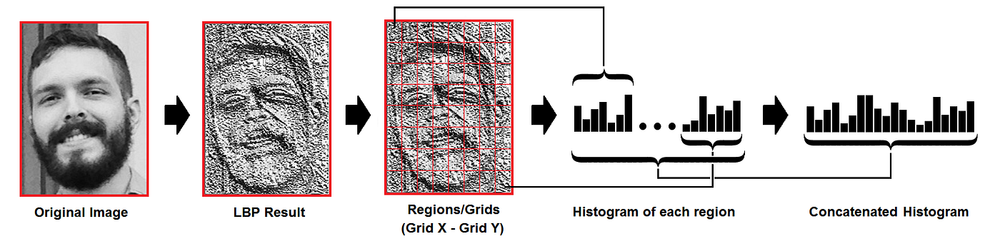

# Face ID (LBPH)
## Webcam → Holdout Eval → Streamlit Realtime

**Tujuan:**  
Bangun sistem **pengenalan wajah** per nama: **ambil data webcam → evaluasi holdout → retrain full + kalibrasi → deploy realtime** (tanpa slider threshold).

---

## Mengapa Proyek Ini?
- **Praktis**: pipeline CV/ML end-to-end yang bisa langsung demo.
- **Ringan**: **OpenCV LBPH** → tanpa GPU.
- **Realtime**: **Streamlit WebRTC** (kamera langsung di browser).
- **Good practice**: fokus **data**, **evaluasi**, **kalibrasi**, **privasi**.

---

## Alur Besar
1. **Capture** dataset per **nama** via **webcam** (`src/collect.py`).
2. **Split holdout** per identitas (default **80/20**).
3. **Train & Eval** LBPH (accuracy, CM, per-class).
4. **Retrain Full + Kalibrasi otomatis** → simpan `model + labels + calibration`.
5. **Deploy** realtime via **Streamlit** (`src/streamlit_app.py`).

---

## Struktur Repo (final)
```

face-id/
├─ data/
│  ├─ raw/                 # dataset (subfolder = nama orang)
│  └─ models/              # lbph_model.yml, labels.json, calibration.json
├─ src/
│  ├─ collect.py           # capture via webcam (per identitas)
│  ├─ train_eval.py        # holdout eval → retrain full → save + calibration
│  └─ streamlit_app.py     # UI Streamlit realtime (WebRTC, auto-threshold)
├─ requirements.txt
└─ README.md

```

---

## Dependensi & Instalasi
**requirements.txt**
```

opencv-contrib-python==4.10.0.84
numpy==2.0.2
pillow==10.4.0
streamlit==1.39.0
streamlit-webrtc==0.47.7
av==12.3

````
**Setup**
```bash
python -m venv .venv
# Windows: .venv\Scripts\activate
# macOS/Linux:
source .venv/bin/activate
pip install -r requirements.txt
````

> Penting: gunakan **opencv-contrib-python** (bukan `opencv-python`) agar `cv2.face` tersedia.

---

## Intuisi LBPH (singkat)

* **LBP**: bandingkan intensitas piksel dengan tetangga → pola biner lokal.
* **LBPH**: histogram LBP per grid → vektor fitur wajah.
* **Prediksi**: cocokkan vektor ke model → skor **jarak** (kecil = mirip).
* **Keputusan**: bandingkan jarak vs **threshold** (ambang).

---


---

## Privasi & Etika Data

* Dapatkan **persetujuan** orang yang direkam.
* Simpan **secukupnya** (grayscale 200×200), batasi akses.
* Jelaskan **tujuan** & **masa simpan**.
* Hindari penggunaan untuk verifikasi sensitif tanpa otorisasi.

---

## 1) Ambil Dataset via Webcam

**Perintah**

```bash
python src/collect.py
```

**Aksi pengguna**

* Ketik **nama** (mis. `budi`) → webcam terbuka.
* Tekan **`s`** untuk simpan; **`q`** untuk selesai orang itu.
* Ulangi untuk nama lain. ENTER kosong → selesai.

**Tips**

* Per identitas **≥ 20–60** gambar.
* Variasi **pose/ekspresi/cahaya**.
* Wajah cukup besar di frame; hindari backlight.

---

## 2) Split Holdout (per identitas)

* Bagi data tiap orang: **train vs test** (mis. 80/20).
* Tujuan: estimasi akurasi yang **jujur** (bukan di-train set).
* Data sangat sedikit → tetap sisakan **1** sampel test (sanity check).

> Evaluasi lebih stabil (opsional): **k-fold per identitas**.

---

## 3) Train & Evaluasi Holdout

* **Train** LBPH (dengan **CLAHE**) pada train-set.
* **Evaluasi** di holdout:

  * **Accuracy** total,
  * **Confusion Matrix** (baris=true, kolom=pred),
  * **Per-class accuracy** (ketahui kelas yang sulit).

---

## 4) Retrain Full + Kalibrasi Otomatis

* **Retrain** pada seluruh data (train+test) → model final.
* **Kalibrasi otomatis** (default: **persentil 95 + margin 10**):

  * Threshold **per-kelas** & **global** → `calibration.json`.
  * Mengurangi “unknown” di kondisi real tanpa slider manual.

> Output: `data/models/lbph_model.yml`, `labels.json`, `calibration.json`.

---

## 5) Deploy Realtime — Streamlit WebRTC

**Jalankan**

```bash
streamlit run src/streamlit_app.py
```

**Fitur**

* Live **webcam** (WebRTC) di browser.
* **Auto-threshold** dari `calibration.json` (prioritas per-kelas → global → fallback).
* Toggle **“Lebih toleran”** (naikkan threshold ~15%).
* Overlay **brightness** & **sharpness** untuk diagnosa kualitas.

> Akses non-localhost sering butuh **HTTPS** untuk izin kamera → gunakan tunnel (ngrok/cloudflared) atau jalankan lokal.

---

## Troubleshooting Cepat

* **`cv2.face` tidak ada**

  ```bash
  pip uninstall -y opencv-python opencv-python-headless
  pip install opencv-contrib-python==4.10.0.84
  ```
* **Kamera tidak muncul**: izinkan kamera di browser/OS; non-localhost → HTTPS.
* **Banyak “unknown”**:

  * Pastikan training pakai **CLAHE** (sudah di `train_eval.py`).
  * Aktifkan **“Lebih toleran”** atau tambah data.
  * Cek overlay **brightness ≥ ~70** & **sharpness ≥ ~80**.
* **Salah identifikasi**: matikan “Lebih toleran”, tambah data, bersihkan outlier blur.

---

## Checklist

* [ ] Struktur repo sesuai (collect → train_eval → streamlit_app).
* [ ] Dataset per identitas ≥ 20–60 gambar (variasi).
* [ ] Holdout eval tampil (accuracy, CM, per-class).
* [ ] Model final + kalibrasi tersimpan (`.yml`, `.json`, `.json`).
* [ ] Streamlit realtime berjalan & prediksi stabil.
* [ ] Kualitas frame oke (brightness/sharpness).

---

## Tugas / Output

1. Repo (tanpa env) + contoh kecil `data/raw/` & **`data/models/`** hasil train.
2. **Screenshot**:

   * Holdout eval (accuracy + CM),
   * UI Streamlit realtime saat prediksi.
3. **Catatan 1–2 halaman**:

   * Observasi kalibrasi (global vs per-kelas),
   * Kendala & solusi,
   * Rencana perbaikan (augmentasi, tambah data, embedding modern).

---

## Ide Lanjutan

* **Augmentasi** ringan (flip/brightness).
* **k-fold per identitas** untuk evaluasi lebih stabil.
* **Model modern**: embedding (FaceNet/ArcFace/InsightFace) + classifier.
* **Privasi**: enkripsi model, kontrol akses, retensi data.

---

## Ringkasan

* Pipeline end-to-end yang **siap demo**: capture → evaluasi → retrain + kalibrasi → **Streamlit realtime**.
* **Konsistensi praproses** & **kalibrasi otomatis** = kunci mengurangi “unknown”.
* Fokus pada **kualitas data** & iterasi cepat dari feedback UI.
