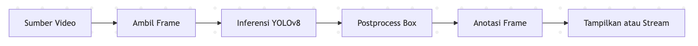
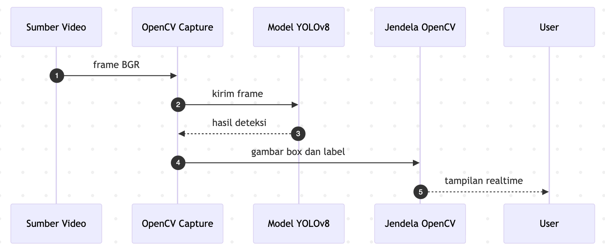
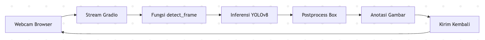
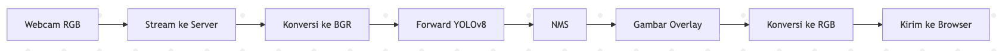

# Deteksi Objek Realtime dengan YOLOv8  
**Aplikasi Lokal OpenCV + Streaming Webcam Gradio**

- Apa yang dibangun
- Alasan desain
- Teori metode deteksi objek
- Alur data end-to-end
- Kinerja, troubleshooting, dan pengembangan lanjut

---

## Agenda

1. Tujuan dan ruang lingkup
2. Gambaran sistem
3. File 1: `detect.py` realtime via OpenCV
4. File 2: `app.py` realtime via Gradio streaming
5. Teori YOLOv8: backbone, neck, head, NMS
6. Postprocessing dan visualisasi
7. Alur sistem end-to-end
8. Optimasi kinerja dan kompromi
9. Keamanan dan privasi
10. Troubleshooting dan validasi
11. Roadmap pengembangan

---

## Tujuan

- Memakai **model pretrained** yang **cepat** dan **cukup akurat**
- Menyediakan **dua UI realtime**:
  - Aplikasi desktop lokal dengan **OpenCV**
  - Aplikasi **web** di browser via **Gradio streaming**
- Kode **sederhana**: tanpa argparser, default ke MP4 atau webcam
- Mudah dikembangkan ke **RTSP**, **tracking**, **rekam video**, dan **custom model**

---

## Gambaran Sistem

**Komponen**
- **Model**: YOLOv8n pretrained COCO 80 kelas
- **Aplikasi lokal**: `detect.py` untuk capture dan display via OpenCV
- **Aplikasi web**: `app.py` streaming webcam browser via Gradio

**Karakteristik**
- Inference per frame
- Overlay bounding box ringan dengan OpenCV
- Stateful pada objek model, stateless per frame

---

## Arsitektur Tingkat Tinggi



Catatan:

* Sumber video: Webcam, MP4, RTSP
* Core inferensi sama dipakai kedua aplikasi

---

## `detect.py` — Realtime Desktop App

**Tugas**

* Buka **VideoCapture**: webcam index 0 atau path file MP4 atau RTSP
* Tiap frame:

  1. Jalankan YOLOv8
  2. Gambar bounding box dan label
  3. Tampilkan via `cv2.imshow`
* Keluar dengan tombol `q`

---

**Kelebihan**

* Latensi rendah
* Kontrol penuh pipeline capture

**Kekurangan**

* Hanya desktop lokal, butuh akses kamera OS

---

## `detect.py` — Alur Data



---

## `app.py` — Realtime di Browser

**Tugas**

* Input Gradio `Image` `sources: webcam` `streaming: true`
* Tiap frame masuk:

  1. Konversi RGB ke BGR untuk OpenCV
  2. Inference YOLOv8
  3. Gambar box dan label
  4. Return RGB beranotasi ke browser

**Kelebihan**

* Multiplatform, via browser
* Tanpa plugin tambahan

**Kekurangan**

* Throughput dipengaruhi jaringan dan compute server

---

## `app.py` — Alur Data



---

## Mengapa YOLOv8n

* **Single stage detector** yang dioptimalkan untuk kecepatan
* **Pretrained COCO**: langsung pakai tanpa training
* **Balance** akurasi vs performa baik untuk CPU atau GPU kecil
* API Python **ultralytics** sederhana

Alternatif: `yolov8s.pt` untuk akurasi lebih tinggi, YOLOv10, atau checkpoint kustom.

---

## Teori Deteksi Objek

* Input: citra atau frame video
* Output: himpunan objek berisi:

  * **Bounding box** koordinat piksel
  * **Label kelas** dari kamus tetap
  * **Skor kepercayaan** 0 sampai 1
* Dua keluarga besar:

  * **Two stage**: proposal lalu klasifikasi
  * **Single stage**: regresi box + klasifikasi dalam satu pass → keluarga YOLO

---

## YOLOv8 — Komponen Inti

* **Backbone**: ekstraksi fitur convolutional modern
* **Neck**: fusi fitur multi-skala untuk objek kecil hingga besar
* **Head**: prediksi box dan logit kelas di beberapa skala
* **Selama training**:

  * **Loss regresi box**: varian IoU seperti CIoU atau SIoU
  * **Loss objectness**: probabilitas mengandung objek
  * **Loss klasifikasi**: BCE atau cross-entropy multi-kelas
* **Saat inferensi**:

  * Menghasilkan banyak kandidat box
  * **Non Maximum Suppression** memilih box terbaik

---

## Postprocessing — Non Maximum Suppression

* Banyak kandidat bertumpuk untuk objek yang sama
* **NMS** mempertahankan box skor tertinggi dan menyingkirkan box lain dengan **IoU** di atas ambang
* Ambang umum:

  * **Confidence** sekitar 0.25
  * **IoU NMS** sekitar 0.45
* Hasil akhir: set box yang ringkas dan stabil per frame

---

## Konvensi Koordinat dan Warna

* OpenCV: **BGR**, Gradio: **RGB**
* Box format: `x1 y1 x2 y2` dalam piksel
* Visualisasi:

  * `cv2.rectangle` untuk box
  * `cv2.putText` untuk label dan skor
  * Background label kecil solid agar mudah dibaca

---

## Alur End To End — Desktop


---

## Alur End To End — Browser



---

## Optimasi Kinerja

* **Model**: `yolov8n.pt` untuk cepat, `yolov8s.pt` untuk akurasi
* **Ukuran input**: downscale misal lebar 640 untuk naikkan FPS
* **Batching**: 1 frame per panggilan, sederhana dan stabil
* **Perangkat**: aktifkan GPU jika ada, CPU masih memadai untuk model kecil
* **I O**: capture webcam dan streaming punya biaya sendiri
* **Gambar overlay**: banyak box per frame akan menurunkan FPS

---

## Anatomi Latensi

* Latensi capture
* Latensi preprocessing
* Latensi forward model
* Latensi postprocess
* Latensi render atau transfer

**Target**: total di bawah 100–150 ms agar terasa mulus

---

## Kompromi Kualitas vs Kecepatan

* Naikkan **confidence threshold** agar box lebih sedikit
* Perkecil **resolusi input** untuk mempercepat inferensi
* Pilih **model lebih kecil**
* Abaikan teks label pada box sangat kecil

---

## Pertimbangan Akurasi

* Dataset COCO mungkin tidak memuat objek domain khusus
* Potensi **false positives** pada latar rumit
* Objek kecil atau jauh lebih sulit
* **Motion blur** menurunkan skor

**Mitigasi**: fine-tuning di dataset Anda nanti

---

## Keamanan dan Privasi

* Browser akan meminta izin akses kamera
* Hindari menyimpan frame mentah di produksi
* Jika merekam output, pastikan **izin** dan **kebijakan penyimpanan**
* Untuk deployment jarak jauh, pertimbangkan anonimisasi atau inferensi on-device

---

## Troubleshooting

* **Error wasm_utils Gradio**
  Penyebab: mismatch versi paket streaming pihak ketiga.
  Solusi: gunakan **streaming native Gradio** via `Image` dan `.stream()` seperti di `app.py` ini.

* **Kamera tidak terdeteksi**
  Cek index webcam, izin OS, atau gunakan path RTSP

* **FPS rendah**
  Pakai `yolov8n.pt`, kecilkan resolusi, aktifkan GPU, naikkan `stream_every` di Gradio

* **Jendela tidak tampil**
  Pastikan lingkungan non-headless, atau tulis video ke file sebagai fallback

---

## Validasi dan Pengujian

* Coba gambar umum: orang, mobil, sepeda
* Verifikasi label dan skor masuk akal, misal >0.5
* Uji kasus sulit:

  * Pencahayaan rendah
  * Gerak cepat
  * Banyak objek kecil
* Bandingkan FPS di berbagai pengaturan

---

## Roadmap Pengembangan

* **Object tracking** untuk ID konsisten antar frame
* **RTSP** untuk CCTV dan IP camera
* **Perekaman video** output beranotasi
* **Model switcher** di UI Gradio
* **Fine-tuning** pada dataset kustom
* **Batching server-side** untuk multi-klien

---

## Potongan Kode Kunci

**Fungsi deteksi per frame**

```python
def detect_frame(frame_rgb):
    frame_bgr = cv2.cvtColor(frame_rgb, cv2.COLOR_RGB2BGR)
    results = yolo_model(frame_bgr, verbose=False)[0]
    annotated_bgr = draw_boxes_bgr(frame_bgr.copy(), results)
    return cv2.cvtColor(annotated_bgr, cv2.COLOR_BGR2RGB)
```

---

**Gambar overlay**

```python
def draw_boxes_bgr(img, res):
    for box, score, cls_id in zip(res.boxes.xyxy.cpu().numpy(),
                                  res.boxes.conf.cpu().numpy(),
                                  res.boxes.cls.cpu().numpy()):
        x1, y1, x2, y2 = box.astype(int)
        label = f"{CLASS_NAMES[int(cls_id)]} {score*100:.1f}%"
        cv2.rectangle(img, (x1, y1), (x2, y2), (0,255,0), 2)
        (tw, th), base = cv2.getTextSize(label, cv2.FONT_HERSHEY_SIMPLEX, 0.5, 1)
        cv2.rectangle(img, (x1, max(y1 - th - base, 0)), (x1 + tw, y1), (0,255,0), -1)
        cv2.putText(img, label, (x1, y1 - base), cv2.FONT_HERSHEY_SIMPLEX, 0.5, (0,0,0), 1)
    return img
```

---

## Langkah Demo

1. Install: `pip install ultralytics opencv-python gradio`
2. Jalankan aplikasi desktop: `python detect.py`
3. Jalankan aplikasi web: `python app.py` lalu izinkan akses kamera
4. Amati bounding box dan skor yang berubah secara realtime

---

## Ringkasan

* Dua frontend realtime di atas satu detektor YOLOv8
* Pemisahan jelas antara capture, inferensi, visualisasi
* Pola siap-produksi dengan jalur pengembangan ke tracking dan custom model
* Mudah disesuaikan skenario lokal maupun web

---

## Tanya Jawab

Terima kasih!
